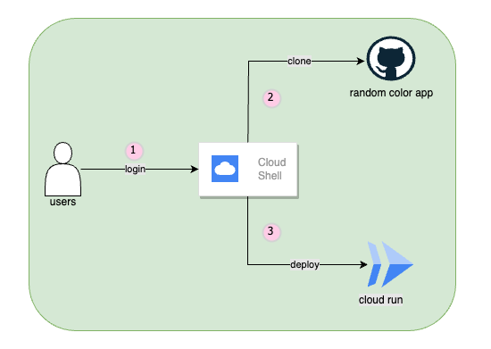

## RANDOM COLOR APP

A simple app that renders a html page that changes color each time you refresh your screen!

https://github.com/boltdynamics/random-color-app/assets/42393225/127aa19e-217d-4d85-94fe-47301ae96aac

### Prerequisites

* [Python 3.12](https://www.python.org/downloads/)
* [Pipenv](https://pipenv.pypa.io/en/latest/installation.html)
* [Git](https://git-scm.com/downloads)
* [Gcloud CLI](https://cloud.google.com/sdk/docs/install)

### Run the color app locally

```bash
pipenv install
pipenv run python3 main.py
```

### Architecture Diagram



### Commands to run on google cloud shell

* Create a folder
```bash
mkdir projects && cd projects
```

* Clone the repository
```bash
git clone https://github.com/boltdynamics/random-color-app
```

* Deploy app to Google Cloud Run
```bash
gcloud run deploy random-color-app --source . --allow-unauthenticated --region=us-central1 --project <project_id>
```
